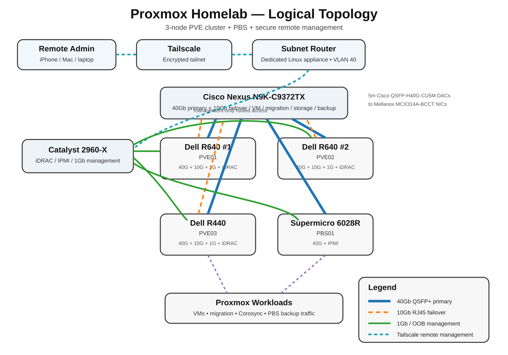

# Proxmox homelab logical topology

This diagram reflects the current planned homelab design:

- 3-node Proxmox VE cluster: 2 × Dell PowerEdge R640 + 1 × Dell PowerEdge R440
- Proxmox Backup Server: Supermicro 6028R-E1CR24N
- Cisco Nexus N9K-C9372TX for 40Gb primary and 10Gb failover/data traffic
- Cisco Catalyst 2960-X for iDRAC, IPMI, and 1Gb management
- Mellanox ConnectX-3 Pro MCX314A-BCCT 40Gb NICs
- Cisco QSFP-H40G-CU5M 5 m passive DAC cables

## Link roles

- **40Gb QSFP+** — primary high-speed server connectivity for VM, migration, storage, and backup traffic.
- **10Gb RJ45** — secondary/failover path on the Dell Proxmox nodes.
- **1Gb / OOB** — Catalyst 2960-X path for iDRAC, IPMI, and management.

See also [RACK-LAYOUT.md](./RACK-LAYOUT.md) for the physical front/rear rack layout and cable-routing plan.
